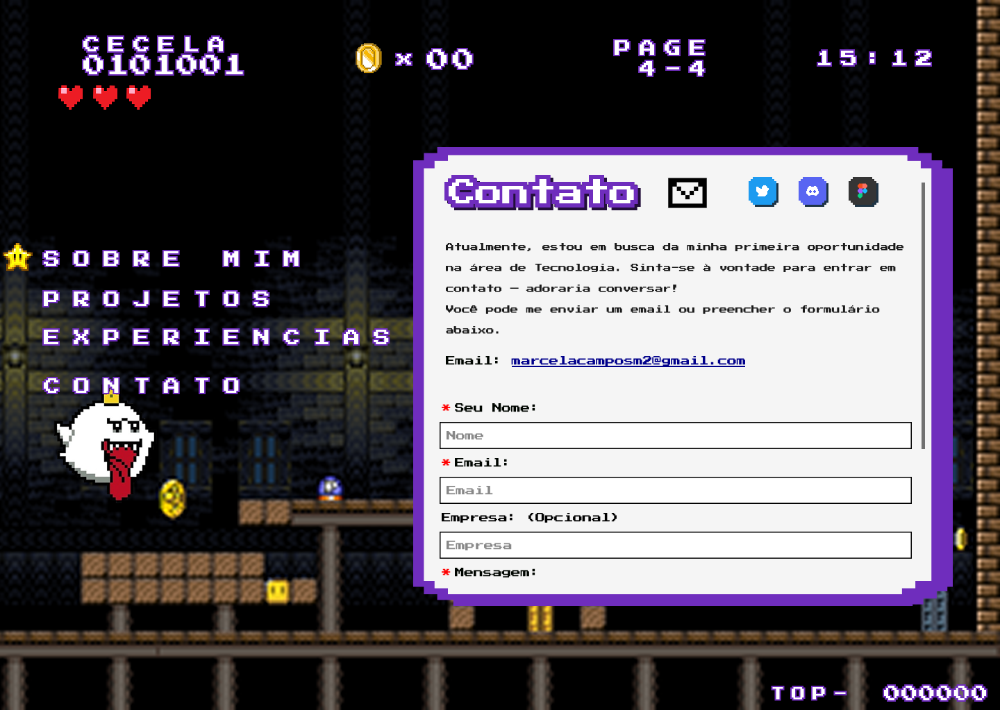
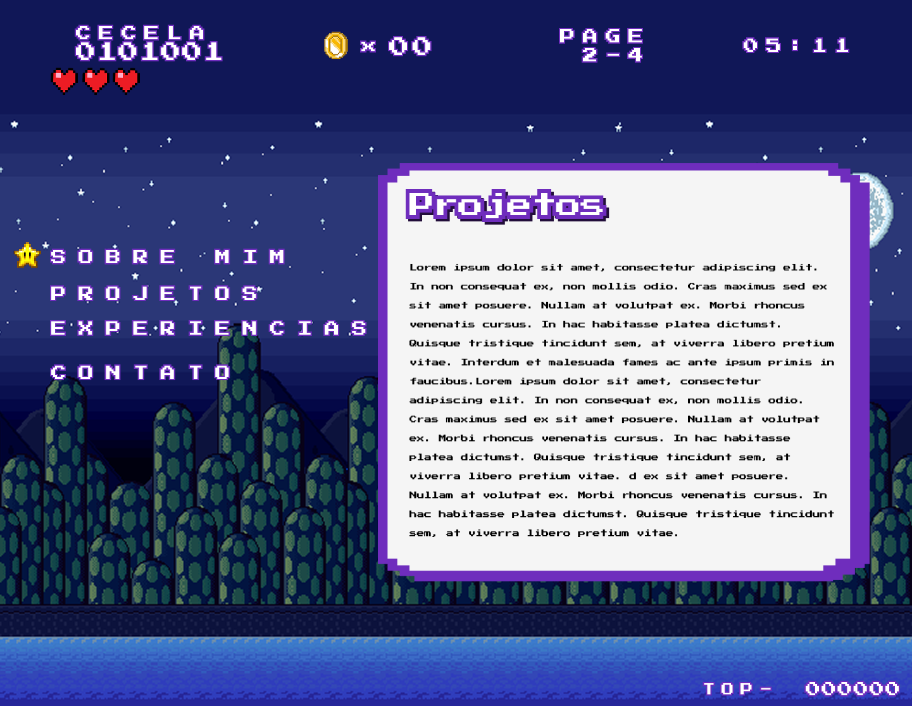
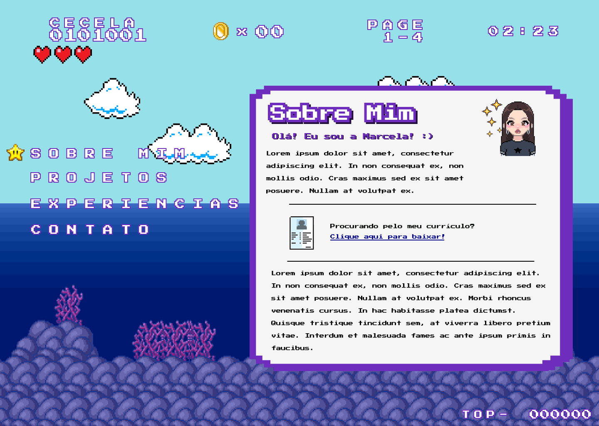
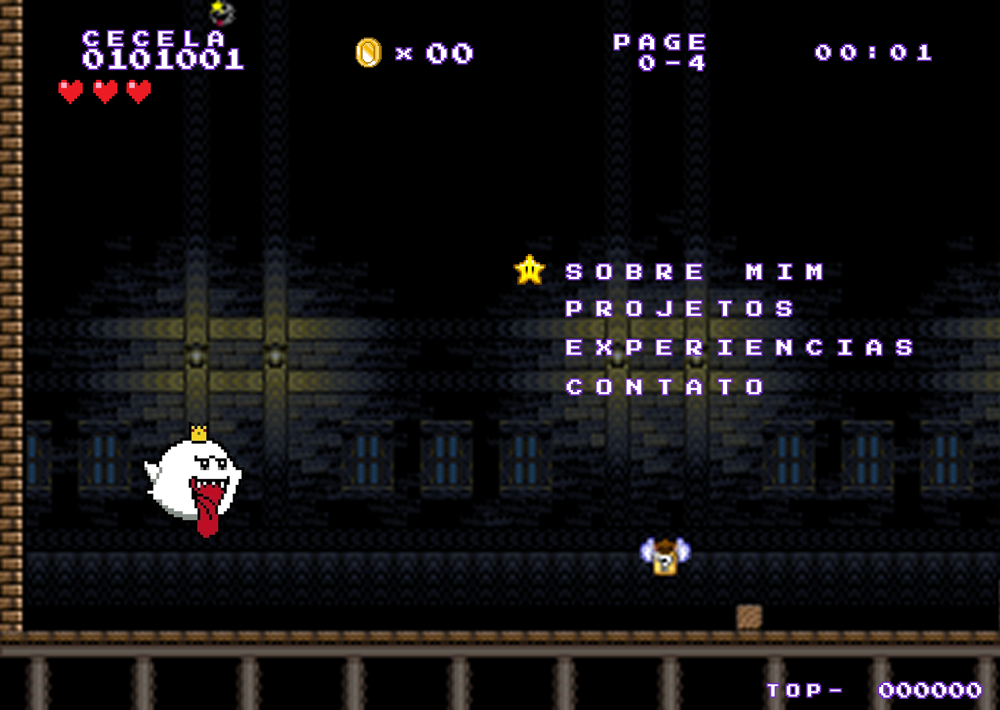
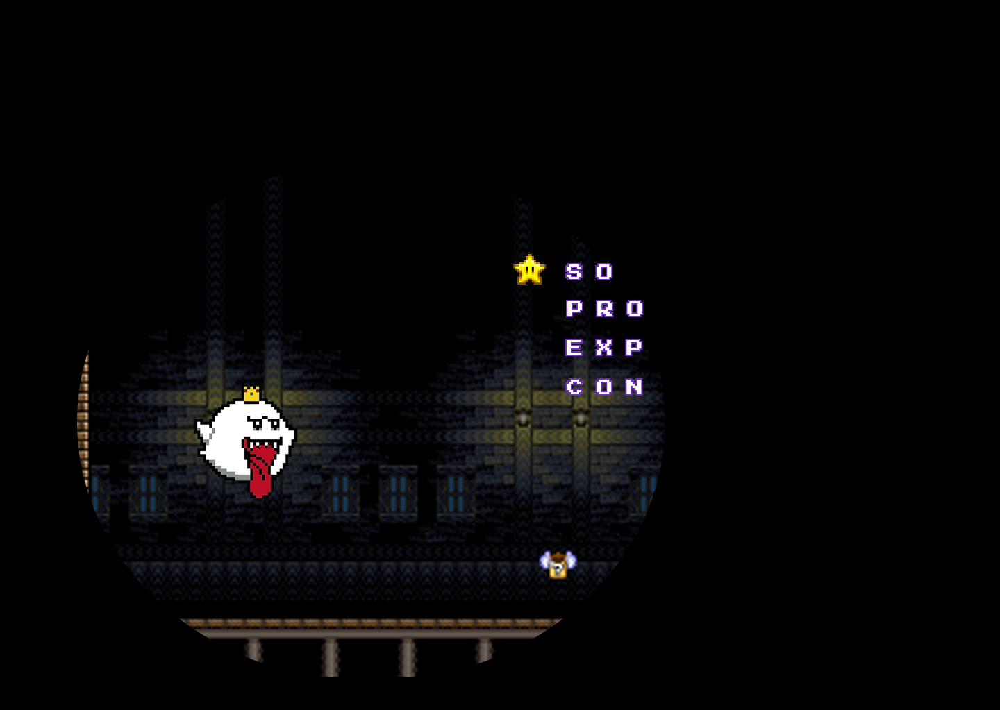
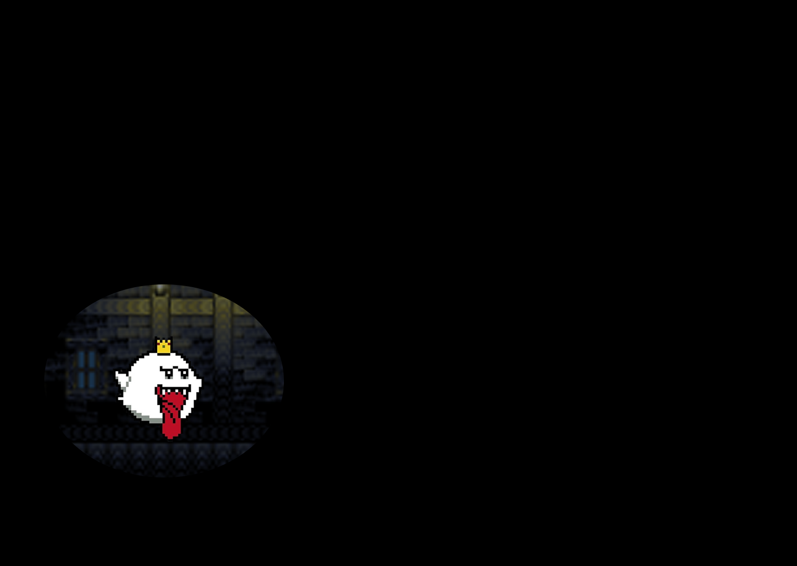
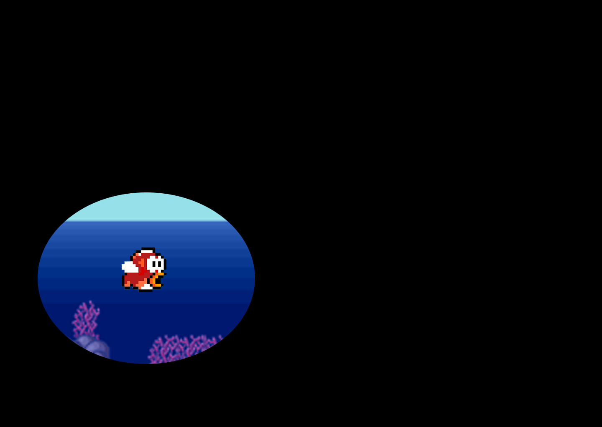
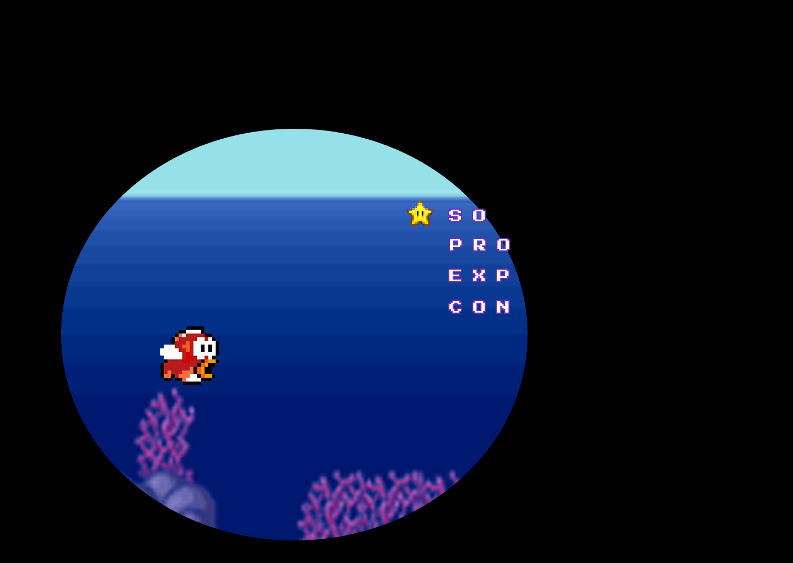
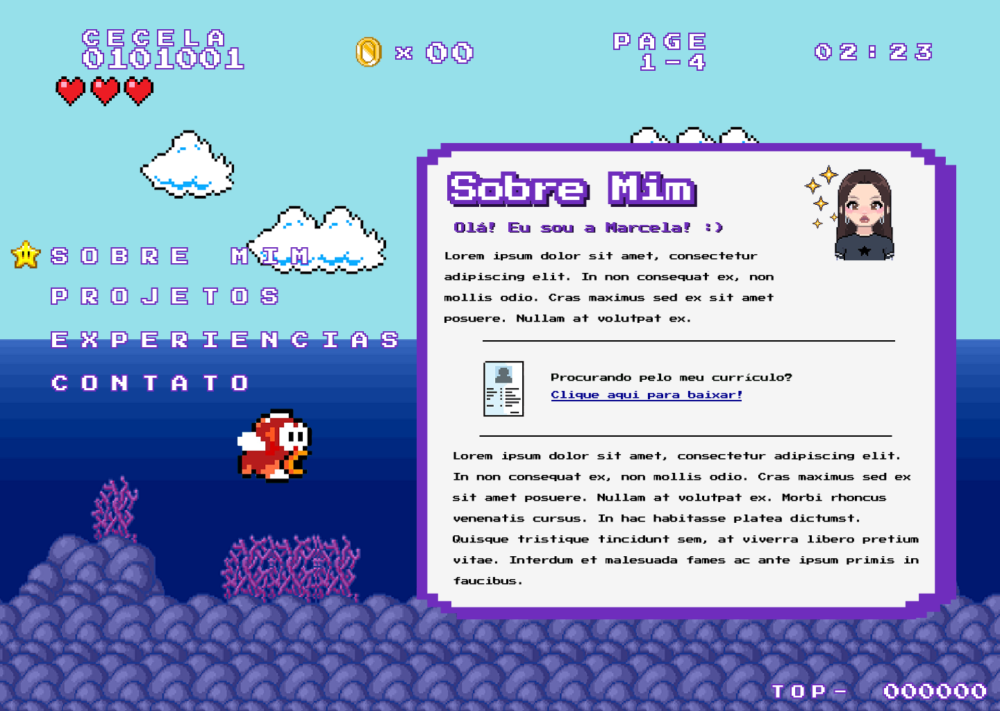
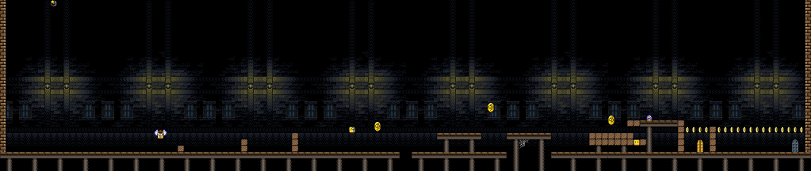

# Portfólio Profissional - Marcela Mendes Campos


## Sobre o Projeto

Este projeto é a materialização do meu portfólio profissional, desenvolvido como uma atividade para a disciplina de **Laboratório de Desenvolvimento de Software**, do curso de **Engenharia de Software**. Para criar uma experiência que fosse ao mesmo tempo funcional e pessoal, busquei inspiração em um universo que marcou minha infância: os jogos clássicos. Toda a identidade visual do site foi construída com uma estética pixel art, buscando traduzir a nostalgia e a criatividade dos games em uma apresentação única da minha trajetória profissional.

## 📋 Índice

<!-- - [Link para o Site](#-link-para-o-site-na-nuvem) -->
- [Funcionalidades](#-funcionalidades)
- [Do Wireframe à Tela Final](#-do-wireframe-à-tela-final)
- [Tecnologias e Dependências](#-tecnologias-e-dependências)
- [Estrutura de Diretórios](#-estrutura-de-diretórios)
- [Como Executar e Desenvolver](#-como-executar-e-desenvolver)
- [Autor](#-autor)

---
<!-- 
<!-- ## 🌐 Link para o Site na Nuvem -->

<!-- > **Acesse a versão publicada do projeto:** **[https://seu-portfolio.vercel.app/](https://seu-portfolio.vercel.app/)** -->
<!-- *(Observação: O deploy será realizado ao final da Sprint 03)* -->


## ✅ Funcionalidades

-   [ ] **Menu de Navegação:** Permite o acesso rápido a todas as seções do site.
-   [ ] **Seção "Sobre Mim":** Apresentação bilíngue (PT/EN) com destaques sobre formação e objetivos.
-   [ ] **Seção "Projetos":** Layout em linha do tempo com detalhes, link para o repositório e mídias visuais de cada projeto.
-   [ ] **Seção "Experiências":** Listagem organizada de experiências profissionais, estágios e freelances.
-   [ ] **Seção "Contato":** Ícones clicáveis para redes sociais e um formulário de contato funcional.
-   [ ] **Responsividade:** Interface adaptável para desktops, tablets e celulares.

---

## 🎨 Design e Animações de Transição

### Prototipação e Telas Principais

Abaixo estão os protótipos de média fidelidade criados no Figma, lado a lado com as telas finais da aplicação, demonstrando a evolução da interface de cada seção principal do portfólio.

| Interface Inicial | Seção de Contato | Seção de Projetos | Seção Sobre Mim |
| :---: | :---: | :---: | :---: |
| **Wireframe (Figma)** | **Wireframe (Figma)** | **Wireframe (Figma)** | **Wireframe (Figma)** |
|  |  |  | |

---

As transições entre as seções são inspiradas em mecânicas de jogos clássicos, criando uma navegação única e divertida. Abaixo estão detalhadas as principais animações.

### Transição para as Seções "Projetos", "Experiência" e "Sobre Mim"

Inspirada nas mudanças de fase dos jogos de plataforma, ao clicar em "Projetos", "Experiência" ou "Sobre Mim", a tela se fecha em um círculo centrado no mascote e se abre na nova seção, simulando a entrada em um novo mundo.

### Transição para as Seções

Inspirada nas mudanças de fase dos jogos de plataforma, esta animação detalha o processo de transição que ocorre ao navegar entre as seções "Projetos", "Experiência" e "Sobre Mim".

| 1. Tela Inicial | 2. Início do Fechamento | 3. Tela Fechada | 4. Início da Abertura | 5. Final da Abertura | 6. Tela Final ("Sobre Mim") |
| :---: | :---: | :---: | :---: | :---: | :---: |
| O usuário está na tela inicial, pronto para navegar. | Após o clique, o efeito de "iris wipe" começa a fechar a tela. | O círculo se fecha por completo, deixando a tela escura por um instante. | Imediatamente, o círculo se expande, começando a revelar a nova seção. | A animação de abertura está quase completa, mostrando a maior parte da tela. | A transição termina, e a seção "Sobre Mim" é exibida por completo. |
|  |  |  |  |  |  |

---

### Transição para a Seção "Contato"

Para tornar a navegação mais imersiva, a transição para a seção de Contato é uma pequena jornada. Ao clicar, o mascote anda pelo cenário do rodapé até chegar ao seu destino, guiando o olhar do usuário de forma lúdica.

---

#### **Passo 1: Clique Inicial e Passo 3: Chegada ao Destino**

Aqui vemos o ponto de partida e o ponto final da jornada do mascote.

| 1. Estado Inicial | 3. Estado Final (Contato) |
| :---: | :---: |
| O usuário clica no item "Contato" em qualquer parte do site. | O mascote para ao lado das informações de contato, completando a jornada. |
|  |  |

---

#### **Passo 2: O Percurso Panorâmico**

Abaixo, a imagem panorâmica ilustra o cenário completo que o mascote irá percorrer na animação de transição para a seção de "Contato". O formato largo é para mostrar a totalidade do caminho planejado.

<br>


---

## 🚀 Tecnologias e Dependências

Este projeto foi gerado com **[Angular CLI](https://github.com/angular/angular-cli) versão 20.1.6**. As principais tecnologias utilizadas incluem:

| Categoria | Tecnologia/Framework |
| :--- | :--- |
| **Framework Principal** | **Angular** |
| **Linguagem** | **TypeScript** |
| **Estilização** | **SCSS/CSS3** |
| **Roteamento** | `Angular Router` |
| **Formulários** | `Angular Forms` |
| **Hospedagem** | `[Vercel / Render / etc.]` |

---

## 📂 Estrutura de Diretórios

A estrutura do projeto segue o padrão gerado pelo Angular CLI, contendo os diretórios e arquivos de configuração essenciais para o desenvolvimento e build da aplicação.

```sh
/MEU_PORTFOLIO
├── .angular/             # Arquivos de cache e build internos do Angular CLI
├── .vscode/              # Configurações do editor Visual Studio Code
├── node_modules/         # Dependências do projeto (instaladas via npm)
├── public/               # Pasta para arquivos estáticos públicos (pode variar com a versão do Angular)
│   ├── assets/           # Imagens, fontes e outros arquivos estáticos
├── src/                  # Diretório principal com o código-fonte da aplicação
│   ├── app/              # Onde ficam os componentes, módulos e serviços
├── .editorconfig         # Regras de formatação de código para o editor
├── .gitignore            # Arquivos e pastas a serem ignorados pelo Git
├── angular.json          # Arquivo de configuração do workspace e dos projetos Angular
├── package-lock.json     # Grava as versões exatas das dependências instaladas
├── package.json          # Lista de dependências e scripts (npm) do projeto
├── README.md             # A documentação que você está lendo
└── tsconfig.*.json       # Arquivos de configuração do compilador TypeScript